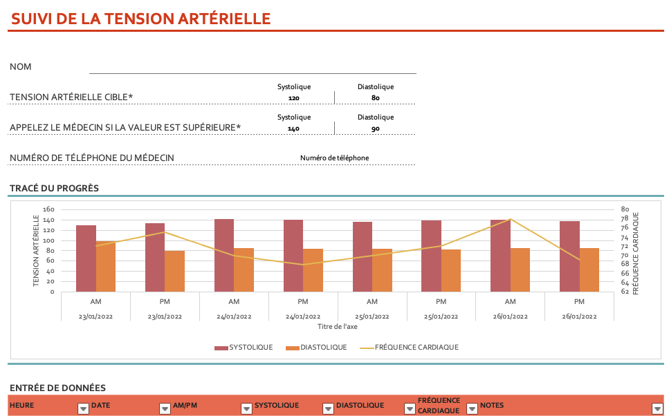

`#0969DA`

# SUIVI DE LA TENSION ARTÉRIELLE
==============================

Une pensée pour les patients et les médecins.
------------------------------------------------------------

Ceci est un partage de connaissance pour faire le suivi médical que nous faisons à la maison, 

Le fichier fait sur **Excel** que nous avons manque d'information, 

Ce fichier permette de mettre nos compétences pour rendre un jour peut-être se suivie beaucoup plus interactif. 

Je pensais même à la réalisation d'un site et à l'envoi sécuriser à son médecin traitant de façon sécuriser un rapport médical. 

Si vous avez des **propositions ou des [idées écrivez moi](iba99@icloud.com)**. 

<!-- 

  -->
  
  The background color is `#ffffff` for light mode and `#000000` for dark mode.